Bayer图像格式
===========
Bayer格式图片是伊士曼·柯达公司科学家Bryce Bayer发明的，Bryce Bayer所发明的拜耳阵列被广泛运用数字图像。
对于彩色图像，需要采集多种最基本的颜色，如rgb三种颜色，最简单的方法就是用滤镜的方法，红色的滤镜透过红色的波长，
绿色的滤镜透过绿色的波长，蓝色的滤镜透过蓝色的波长。如果要采集rgb三个基本色，则需要三块滤镜，这样价格昂贵，
且不好制造，因为三块滤镜都必须保证每一个像素点都对齐。当用bayer格式的时候，很好的解决了这个问题。
bayer 格式图片在一块滤镜上设置的不同的颜色，通过分析人眼对颜色的感知发现，人眼对绿色比较敏感，
所以一般bayer格式的图片绿色格式的像素是是r和g像素的和。

Bayer格式是相机内部的原始图片，一般后缀名为.raw，一般bayer格式的图片绿色格式的像素是r和g像素的和。
很多软件都可以查看, 比如PS。我们相机拍照下来存储在存储卡上的.jpeg或其它格式的图片，都是从.raw格式转化过来的。
如下图，为bayer色彩滤波阵列，由一半的G，1/4的R，1/4的B组成。


1. bayer格式图像传感器硬件
----------------------
图像传感器的结构如下所示，每一个感光像素之间都有金属隔离层，光纤通过显微镜头，在色彩滤波器过滤之后，投射到相应的漏洞式硅的感光元件上。
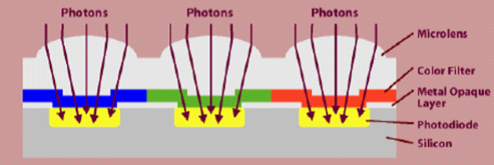

拜耳色彩滤波器的模式、序列、滤波器有很多种，但最常见的模式是由Kodak提出的2*2模式。
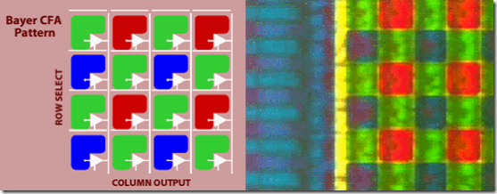
</div>


当Image Sensor往外逐行输出数据时，像素的序列为GRGRGR.../BGBGBG...（顺序RGB）。这样阵列的Sensor设计，使得RGB传感器减少到了全色传感器的1/3，
如下所示。
$$ \frac{\frac{1}{2} + \frac{1}{4} + \frac{1}{4}}{1 + 1 + 1} = \frac{1}{3}$$

2. bayer格式插值红蓝算法实现
-----------------------

每一个像素仅仅包括了光谱的一部分，必须通过插值来实现每个像素的RGB值。为了从Bayer格式得到每个像素的RGB格式，
我们需要通过插值填补缺失的2个色彩。插值的方法有很多（包括领域、线性、3*3等），速度与质量权衡，最好的线性插值补偿算法。
其中算法如下：
	R和B通过线性领域插值，但这有四种不同的分布，如下图所示：

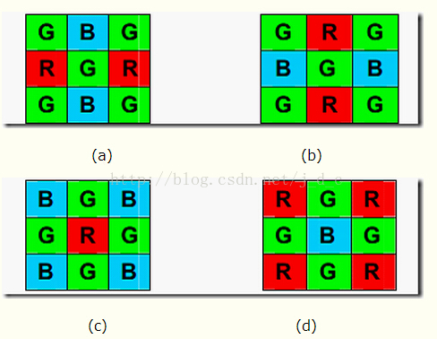


在(a)与(b)中，R和B分别取邻域的平均值。
在(c)与(d)中，取领域的4个B或R的均值作为中间像素的B值。

3. bayer格式插值绿算法实现
----------------------

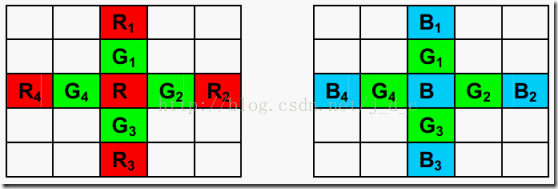

由于人眼对绿光反应最敏感，对紫光和红光则反应较弱，因此为了达到更好的画质，需要对G特殊照顾。
在上述(c)与(d)中，扩展开来就是上图的(e)与(f)中间像素G的取值，都有一定的算法要求，
不同的算法效果上会有差异。经过相关的研究，

(e) 中间像素G值的算法如下：

$$  G(R) = \begin{cases}
\frac{(G1 + G2)}{2}               & \text{|R1-R3| < |R2 - R4|} \\\
\frac{(G3 + G4)}{2}               & \text{|R1-R3| > |R2 - R4|} \\\
\frac{(G1 + G2 + G3 + G4)}{4}     & \text{|R1-R3| = |R2 - R4|}
\end{cases} $$
(f) 中间像素G值的算法如下：

$$  G(B) = \begin{cases}
\frac{(G1 + G2)}{2}               & \text{|B1-B3| < |B2 - B4|} \\\
\frac{(G3 + G4)}{2}               & \text{|B1-B3| > |B2 - B4|} \\\
\frac{(G1 + G2 + G3 + G4)}{4}     & \text{|B1-B3| = |B2 - B4|}
\end{cases} $$

CMOS摄像头这部分转换是在内部用ADC或者ISP完成的，生产商为了降低成本必然会使得图像失真。
当然用外部处理器来实现转换，如果处理器的速度足够NB，能够胜任像素的操作，用上面的算法来进行转换，
皆大欢喜。不过上述算法将直接成倍提高了算法的复杂度，速度上将会有所限制。因此为了速度的提成，
可以直接通过来4领域G取均值来中间像素的G值，将会降低一倍的速率，而在性能上差之甚微，算法如下：

$$ G(R) = \frac{G1 + G2 + G3 + G4}{4} \text{或} G(B) = \frac{G1 + G2 + G3 + G4}{4} $$

如果能够通过损失图像的额质量，来达到更快的速度，还可以取G1、G2的均值来实现，
但是这样的做法会导致边沿以及跳变部分的失真。

例：opencv程序实现bayer转BGR
``` c++
Mat bayerImage = imread("cam.bmp",2|4);
Mat bgrImage;
cvtColor(bayerImage,bgrImage,CV_BayerGR2BGR);
```
原图：
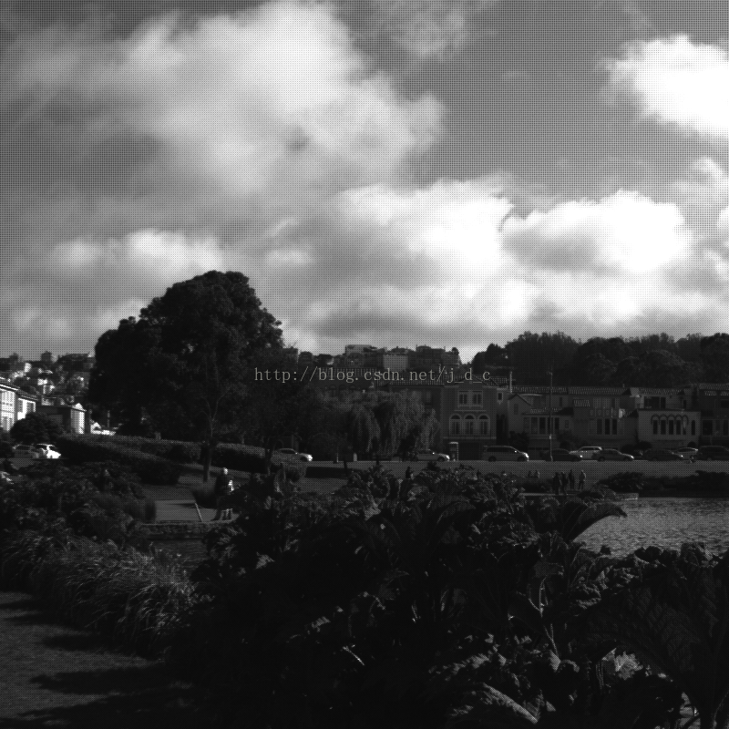
结果：
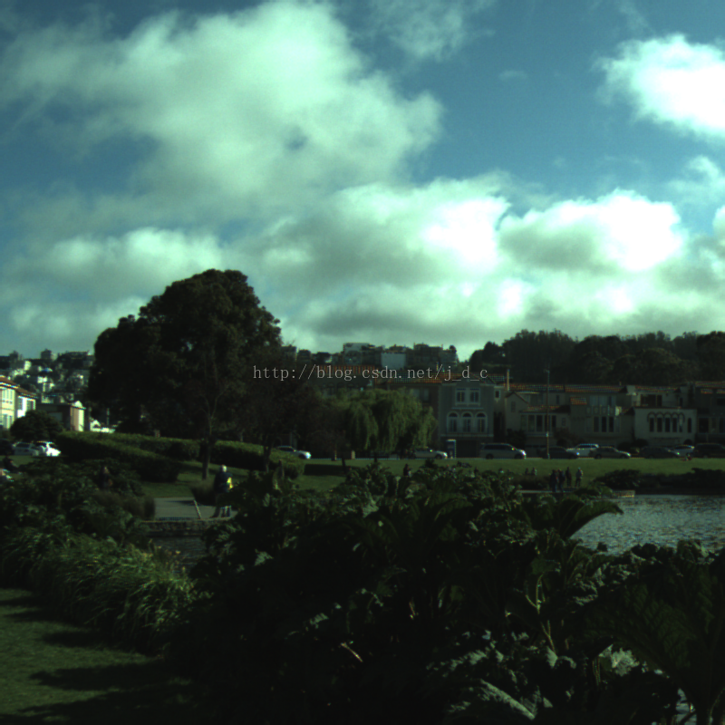


灰度图像(Grayscale image)
=======================
灰度数字图像是每个像素只有一个采样颜色的图像。这类图像通常显示为从最暗黑色到最亮的白色的灰度，
尽管理论上这个采样可以任何颜色的不同深浅，甚至可以是不同亮度上的不同颜色。灰度图像与黑白图像不同，
在计算机图像领域中黑白图像只有黑白两种颜色，灰度图像在黑色与白色之间还有许多级的颜色深度。

1. 灰度图像采集
-------------
灰度图像通常是在单个电磁波频谱（如可见光）内测量每个像素的亮度得到的。用于显示的灰度图像通常用每个采样像素8位的非线性尺度来保存，
这样可以有256级灰度。这种精度刚刚能够避免可见的条带失真，并且非常易于编程。但在医学图像与遥感图像等技术应用中，
经常采用更多的级数以充分利用每个像素采样10或12位的传感器精度，并且避免计算时的近似误差，
在这些应用领域每个像素采样16位即65536级得到流行。

2. 在视频系统亮度编码
------------------
a. 在PAL 和 NTSC, the rec601 亮度 (Y'):

$$ Y'=0.299R'+0.587G'+0.114B' $$

b. 在ATSC开发的HDTV的 ITU-R BT.709标准中:

$$ Y'=0.2126R'+0.7152G'+0.0722B' $$


3. 常用方法
-----------
在计算机领域中，这类图像通常显示为从最暗黑色到最亮的白色的灰度，尽管理论上这个采样可以任何颜色的不同深浅，
甚至可以是不同亮度上的不同颜色。灰度图像与黑白图像不同，在计算机图像领域中黑白图像只有黑色与白色两种颜色；
灰度图像在黑色与白色之间还有许多级的颜色深度。但是，在数字图像领域之外，“黑白图像”也表示“灰度图像”，
例如灰度的照片通常叫做“黑白照片”。在一些关于数字图像的文章中单色图像等同于灰度图像，在另外一些文章中又等同于黑白图像。
我们可以通过下面几种方法，将其转换为灰度
	1. 浮点算法  Gray = R * 0.3 + G * 0.59 + B * 0.11

	2. 整数方法  Gray = (R * 30 + G * 59 + B * 11) / 100
	
	3. 移位方法  Gray = (R * 76 + G * 151 + B * 28) >> 8
	
	4. 平均值法  Gray =(R + G + B) / 3
	
	5. 仅取绿色  Gray = G

通过上述任一种方法求得Gray后，将原来的RGB(R,G,B)中的R,G,B统一用Gray替换，形成新的颜色RGB(Gray,Gray,Gray)，
用它替换原来的RGB(R,G,B)就是灰度图了。


HSL HSV 图像编码
==============
HSL 和 HSV（也叫做 HSB）是对RGB 色彩空间中点的两种有关系的表示，它们尝试描述比 RGB 更准确的感知颜色联系，
并仍保持在计算上简单。HSL 表示 hue（色相）、saturation（饱和度）、lightness（亮度），
HSV 表示 hue、saturation、value(色调) 而 HSB 表示 hue、saturation、brightness（明度）。

HSL 和 HSV 二者都把颜色描述在圆柱体内的点，这个圆柱的中心轴取值为自底部的黑色到顶部的白色而在它们中间是的灰色，
绕这个轴的角度对应于“色相”，到这个轴的距离对应于“饱和度”，而沿着这个轴的距离对应于“亮度”，“色调”或“明度”。

这两种表示在用目的上类似，但在方法上有区别。二者在数学上都是圆柱，
但 HSV（色相，饱和度，明度）在概念上可以被认为是颜色的倒圆锥体（黑点在下顶点，白色在上底面圆心），
HSL 在概念上表示了一个双圆锥体和圆球体（白色在上顶点，黑色在下顶点，最大横切面的圆心是半程灰色）。
注意尽管在 HSL 和 HSV 中“色相”指称相同的性质，它们的“饱和度”的定义是明显不同的。

因为 HSL 和 HSV 是设备依赖的 RGB 的简单变换，
(h, s, l) 或 (h, s, v) 三元组定义的颜色依赖于所使用的特定红色、绿色和蓝色“加法原色”。
每个独特的 RGB 设备都伴随着一个独特的 HSL 和 HSV 空间。但是 (h, s, l) 或 (h, s, v)
三元组在被约束于特定 RGB 空间比如 sRGB 的时候就变成明确的了。
HSV 模型在 1978 年由埃尔维·雷·史密斯创立

HSL适用于机器采样，目前的显示器颜色即由这三种基色构成，HLV更符合人类的直观感觉，比如人一般表达一个颜色会这样说：
有点浓的暗红色。而不会说红色占多少，绿色占多少，蓝色占多少。

在Windows的标准颜色对话框中均包含这两种表示方法。RGB的取值范围在0~255之间，HSL的取值在0~1之间，
但Windows系统处理成了0~240取值范围，各种不同环境下的取值参照附表。另外还有CMY/CMYK颜色空间，
常用于印刷行业，以后再将RGB-CMY-CMYK的转换算法贴出。

色相 （Hue）
---------
色相的0度為R(紅)色，120度為G（綠）色，240度為B（藍）色，為了記憶方便，先讓我把角度0度設定為正上方(與CSS3漸層相同)
大家記憶比較方便點，所以以順時針方向旋轉，他們之間的角度就如同下圖所示:
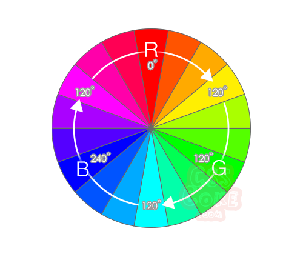

亮度/明度（Lightness）
-------------------
如果我們把上面這張 HSL 色彩的 H(Hue) 平面圖形的亮度（Lightness）轉換成一個立體的圓柱體時，你就能看到如下圖所示

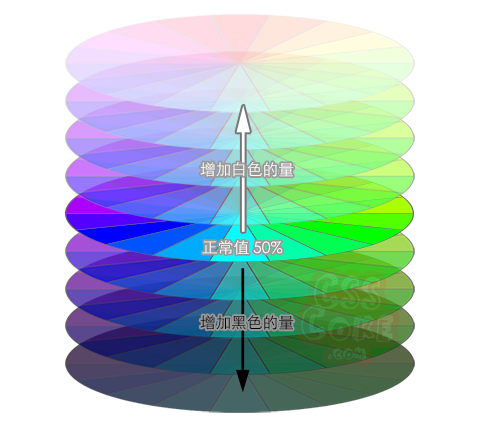

由中間開始，越是上方的就越是增亮(白色份量增加)，增亮到最後就變成純白，而越是往下方則越是縮減亮度(黑色份量增加)，
亮度縮減到最後就變成了黑色，所以一般來說，HSL色彩中的L預設值會是50%，若要變暗一點就把數值往0％調整，
若要變亮變白一點就把數值往100%調整.

飽和度（Saturation）
-----------------
如同亮度（Lightness）一樣，飽和度（Saturation）也是採用百分比方式呈現，如下圖所示


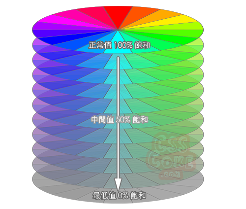

以色彩預設都是100%飽和的情況下，若是要讓色彩變得不那麼鮮豔，就把色彩飽和度（Saturation）往0%的方向調整即可，
色彩飽和度（Saturation）不同於色彩亮度（Lightness）的地方在於，色彩飽和度（Saturation）降低之後，
色彩越是不鮮豔就越接近灰色而不是變黑，這一點千萬要能夠區分。

所以，了解以上HSL三個數值的差異之後，倘若我們今天要一個黃色，那我們就可先設定 HSL(60, 100%, 50%)，
色相60度為黃色，預設100%飽和(鮮豔)，預設正常亮度50%，如果我們需要一個鵝黃色的話，那我們就只需要把黃色多加一點白色，
所以只要修改L的數值即可，像是這樣 HSL(45, 100%, 80%)，如果我們希望色彩接近橙色的話，
那我們就修改色相(Hue)角度往R方向調整即可，像是這樣HSL(40, 100%, 80%)，這樣是不是變得簡單許多呢

用途
---

HSV 模型通常用于计算机图形应用中。在用户必须选择一个颜色应用于特定图形元素各种应用环境中，
经常使用 HSV 色轮。在其中，色相表示为圆环；可以使用一个独立的三角形来表示饱和度和明度。
典型的，这个三角形的垂直轴指示饱和度，而水平轴表示明度。在这种方式下，选择颜色可以首先在圆环中选择色相，
在从三角形中选择想要的饱和度和明度。

HSV 模型的另一种可视方法是圆锥体。在这种表示中，色相被表示为绕圆锥中心轴的角度，
饱和度被表示为从圆锥的横截面的圆心到这个点的距离，明度被表示为从圆锥的横截面的圆心到顶点的距离。
某些表示使用了六棱锥体。这种方法更适合在一个单一物体中展示这个 HSV 色彩空间；
但是由于它的三维本质，它不适合在二维计算机界面中选择颜色。

HSV 色彩空间还可以表示为类似于上述圆锥体的圆柱体，色相沿着圆柱体的外圆周变化，饱和度沿着从横截面的圆心的距离变化，
明度沿着横截面到底面和顶面的距离而变化。这种表示可能被认为是 HSV 色彩空间的更精确的数学模型；
但是在实际中可区分出的饱和度和色相的级别数目随着明度接近黑色而减少。
此外计算机典型的用有限精度范围来存储 RGB 值；这约束了精度，再加上人类颜色感知的限制，使圆锥体表示在多数情况下更实用。

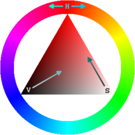


HSL 与 HSV 的比较
---------------
HSL 类似于 HSV。对于一些人，HSL 更好的反映了“饱和度”和“亮度”作为两个独立参数的直觉观念，但是对于另一些人，
它的饱和度定义是错误的，因为非常柔和的几乎白色的颜色在 HSL 可以被定义为是完全饱和的。对于 HSV 还是 HSL 更适合于人类用户界面是有争议的。

W3C 的 CSS3 规定声称“HSL 的优点是它对称于亮与暗（HSV 就不是这样）…”，这意味着：

* 在 HSL 中，饱和度分量总是从完全饱和色变化到等价的灰色（在 HSV 中，在极大值 V 的时候，饱和度从全饱和色变化到白色，这可以被认为是反直觉的）。
* 在 HSL 中，亮度跨越从黑色过选择的色相到白色的完整范围（在 HSV 中，V 分量只走一半行程，从黑到选择的色相）。


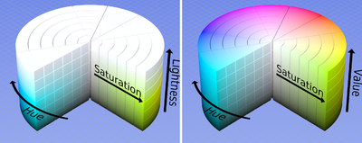

在软件中，通常以一个线性或圆形色相选择器和在其中为选定的色相选取饱和度和明度／亮度的一个二维区域（通常为方形或三角形）
形式提供给用户基于色相的颜色模型（HSV 或 HSL）。通过这种表示，在 HSV 和 HSL 之间的区别就无关紧要了。
但是很多程序还允许你通过线性滑块或数值录入框来选择颜色的明度／亮度，而对于这些控件通常使用要么 HSL 要么 HSV（而非二者）。
HSV 传统上更常用。下面是一些例子：
GIMP 支持在 HSV 色彩空间内的选取颜色的多种方法，包括带有色相滑块的色轮和色方。
*   使用 HSV (HSB)的应用：
        Apple Mac OS X 系统颜色选择器（有一个 H/S 颜色碟和一个 V 滑块）
        Xara Xtreme
        Paint.NET（有一个 H/S 颜色碟和一个 V 滑块）
        Adobe 图形应用程序（Illustrator，Photoshop，等等）
        Turbo Photo
*   使用 HSL 的应用：
        CSS3 规定
        Inkscape（从版本 0.42 开始）
        Macromedia Studio
        Microsoft Windows 系统颜色选择器（包括 Microsoft Paint）
        Paint Shop Pro
        ImageMagick
*   使用 HSV 和 HSL 二者的应用：
        Pixel image editor（从 Beta5 开始）
        Pixia
        Bryce
        GIMP（HSV 用于颜色选择，HSL 用于颜色调整）

与其他颜色模型的比较
----------------
HSV 颜色空间在技术上不支持到辐射测定中测量的物理能量谱密度的一一映射。所以一般不建议做在 HSV 坐标和物理光性质如波长和振幅之间的直接比较。

形式定义
------
HSL 和 HSV 在数学上定义为在 RGB 空间中的颜色的 R, G 和 B 的坐标的变换。

从 RGB 到 HSL 或 HSV 的转换
------------------------
设 (r, g, b) 分别是一个颜色的红、绿和蓝坐标，它们的值是在 0 到 1 之间的实数。设 max 等价于 r, g 和 b 中的最大者。
设 min 等于这些值中的最小者。要找到在 HSL 空间中的 (h, s, l) 值，这里的 h ∈ [0, 360）是角度的色相角，
而 s, l ∈ [0,1] 是饱和度和亮度，计算为：

$$
h = \begin{cases}
	0&deg;   & \text {if max = min} \\\
	60&deg; \times \frac{g - b}{max - min}   & \text {if max = r and $g \ge b $} \\\
	60&deg; \times \frac{g - b}{max - min} + 360&deg; & \text{if max = r and $g \lt b$} \\\
	60&deg; \times \frac{g - b}{max - min} + 120&deg; & \text{if max = g}  \\\
	60&deg; \times \frac{g - b}{max - min} + 240&deg; & \text{if max = b}
\end{cases}
$$
$$l = \frac{1}{2}(max + min)$$
$$
s = \begin{cases}
	0     & \text {if l = 0 or max = min}  \\\
	\frac{max - min}{max + min} = \frac{max - min}{2l}   & \text {if $0 \lt l \le \frac{1}{2}$}  \\\
	\frac{max - min}{2 - (max + min)} = \frac{max - min}{2 - 2l}    & \text {if $l \gt \frac{1}{2}$}
\end{cases}
$$
h 的值通常规范化到位于 0 到 360°之间。而 h = 0 用于 max = min 的（就是灰色）时候而不是留下 h 未定义。
HSL 和 HSV 有同样的色相定义，但是其他分量不同。HSV 颜色的 s 和 v 的值定义如下：
$$
h = \begin{cases}
	0          & \text {if max = 0} \\\
	\frac{max - min}{max} = 1 - \frac{min}{max}   & \text {otherwise}
\end{cases}
$$

从 HSL 到 RGB 的转换
------------------

给定 HSL 空间中的 (h, s, l) 值定义的一个颜色，带有 h 在指示色相角度的值域 [0, 360）中，
分别表示饱和度和亮度的s 和 l 在值域 [0, 1] 中，相应在 RGB 空间中的 (r, g, b) 三原色，
带有分别对应于红色、绿色和蓝色的 r, g 和 b 也在值域 [0, 1] 中，它们可计算为：

首先，如果 s = 0，则结果的颜色是非彩色的、或灰色的。在这个特殊情况，r, g 和 b 都等于 l。
注意 h 的值在这种情况下是未定义的。

当 s ≠ 0 的时候，可以使用下列过程：
$$
q = \begin{cases}
	l \times (1 + s)          & \text {if $l \lt \frac{1}{2}$} \\\
	l + s - (l \times s )     & \text {if $l \ge \frac{1}{2}$}
\end{cases}
$$

$$ p = 2 \times l - q $$

$$ h_k = \frac{h}{360}  \text{(h 规范化到值域[0,1)内)}　$$

$$ t_R = h_k + \frac{1}{3} $$
$$ t_G = h_k $$
$$ t_B = h_k - \frac{1}{3} $$

$$ \text{if($t_C \lt 0$) -> $t_C = t_C + 1.0$ for each $C \in {R,G,B}$} $$

$$ \text{if($t_C \gt 1 $) -> $t_C = t_C$ - 1.0 for each $C \in {R,G,B}$} $$
对于每个颜色向量 Color = ($Color_R, Color_G, Color_B$) = (r, g, b)

$$
Color_C = \begin{cases}
	p + ((q - p) \times 6 \times t_C)                    & \text {if $ t_C \lt \frac{1}{6} $}    \\\
	p + ((q - p) \times 6 \times t_C)                    & \text {if $ t_C \lt \frac{1}{6} $}    \\\
	q                                                    & \text {if $ \frac{1}{6} \le t_C \lt \frac{1}{2} $}    \\\
	p + ((q - p) \times 6 \times (\frac{2}{3} - t_C))    & \text {if $ \frac{1}{2} \le t_C \lt \frac{2}{3} $}    \\\
	p                                                    & \text {otherwise}
\end{cases}
$$

$$\text{for each $ C \in {R,G,B}$}$$

从 HSV 到 RGB 的转换
------------------
类似的，给定在 HSV 中 (h, s, v) 值定义的一个颜色，带有如上的 h，和分别表示饱和度和明度的 s 和 v 变化于 0 到 1 之间，
在 RGB 空间中对应的 (r, g, b) 三原色可以计算为：

$$ hi \equiv  \left[ \frac{h}{60} \right] (mod 6) $$

$$ f = \frac{h}{60} - h_i $$
$$ p = v \times (1 - s) $$
$$ p = v \times (1 - f \times s) $$
$$ p = v \times (1 - (1 - f) \times s) $$

对于每个颜色向量 (r, g, b)

$$
(r,g,b) = \begin{cases}
	{(v,t,p)},   & \text {if $h_i = 0$} \\\
	{(q,v,p)},   & \text {if $h_i = 1$} \\\
	{(p,q,v)},   & \text {if $h_i = 2$} \\\
	{(p,q,v)},   & \text {if $h_i = 3$} \\\
	{(t,p,v)},   & \text {if $h_i = 4$} \\\
	{(v,p,q)},   & \text {if $h_i = 5$} \\\
\end{cases}
$$


Color model 和 Color Space
-------------------------

1. Color Model: 为了表达人眼观察到的颜色，人们从数学模型上定义了一系列不同的color model，
我们常见的有RGB，CMYK，YUV，YPbPr/YCbCr。
2. Color  Space：为了把这样的Color Model数学模型投射到相应的数学表达，根据对于颜色数据的不同处理方式，
存储格式等等，产生了不同的Color Space。

常用的Color Model简介
-------------------

* RGB在计算机显示中广泛采用（比如LCD，LED），其原色（Primary color）为RGB，是一种加性color model。
意思是它是用哪几种光源来投射合成颜色的。几种光源(在纯黑背景上)被混合在一起。也有采用RGBA格式（GPU里面），
Alpha代表透明度。

* CMYK在印刷工业中广泛使用，其原色（Primary color）为 cyan, magenta, yellow, key (black)。
是一种减性color model。意思是它是用几种墨水混合来表达被（白色背景）反射出来的颜色，以合成人眼需要识别的颜色。
* YIQ在 NTSC 电视系统里面广泛使用。Y为亮度信息，IQ为色度信息。
* YUV在PAL电视系统，以及很多Video 捕捉系统里面使用。Y为亮度信息，UV为色差（Chroma）信息。U/V分别等于blue–luminance/red–luminance。

>注：Y’UV vs YUV

>(1). Y表示辉度信息(luminance)—或者说是亮度的感知信息
>(2). Y’ 表示亮度(Luma)信息—或者说是电子化的亮度信息（和显示系统的硬件信号，比如电压直接相关），
>(3). 因为人眼对于亮度的感知与实际的显示亮度不是成正比关系的，并不是说亮度增加一倍，人眼感知的亮度就会增加一倍，
>二者之间有非线性的关系。这个装换就是Gamma矫正。http://en.wikipedia.org/wiki/Gamma_compression
>YPbPr/YCbCr: 是YUV坐标归一化后的一种color model，视频系统里面广泛采用。
>YPbPr是YCbCr的模拟版本，二者实际上是一回事，只是用于模拟和数字格式而已。

应用举例
------
现在移动终端中常用到的Camera Sensor，Spec.一般会指明支持哪些Color format.常常看到类似RGB，或者RGB888，YUV，或者YUV422，YUV420之类的输出格式表示：

* RGB888：

>指的是输出信号用RGB格式，RGB的颜色深度均为8（即一个Pixel的颜色需要3X8=24bit来表示）。传统上有人称为RGB接口，并口，
>PPI口（输出简单，就是8或者16或者24根信号线）等等。不过MIPI口也是可以支持的。

>RGB 格式的缺点是三种颜色的权重是类似的，因此信息很难压缩也不适合在带宽受限系统中传输—但是很适合pixel-by-pixel的画图板式操作，
>所以在显示系统里面被大量使用—比如Mobile display。对于

* YUV422:

>比较传统的YUV格式是YUV444，表示每个YUV分量均由4bit来表示。不过，犹豫人眼对于亮度信息(Y)的敏感度大于对于色度信息（UV）的敏感度，
>因此为了减少信息带宽，在对于视觉要求不高的应用中，部分色度信息可以被减少—称为色度抽样（Chroma subsampling）,
>这样就有了YUV422，甚至是YUV420。

* RAW data:

>RAW data在影像学上只是一种概念，没有统一的标准，其基本思想是把原始的图像数据用尽可能靠近sensor感光输出的信号储存起来供后续处理。
>相对比较通用的RAW格式为DNG (Adobe). 对于移动设备中常用的CMOS sensor，多数不提供RAW data的输出（这一般是单反的feature）。
>一般会用Bayer格式，这个名字来自Bayer 滤镜，指的是一束光线投射到sensor上并产生相应的输出信号的透镜。
>输出的格式通是RGBG,GRGB or RGGB.之所以有两个G分量，一方面最小的感光面用矩形在几何上比较好安排（因此有4个感光分量），
>另一方面人眼对于绿色的敏感度更高一些。

YUV
===
（亦称YCrCb）是被欧洲电视系统所采用的一种颜色编码方法（属于PAL）。YUV主要用于优化彩色视频信号的传输，使其向后兼容老式黑白电视。
与RGB视频信号传输相比，它最大的优点在于只需占用极少的带宽（RGB要求三个独立的视频信号同时传输）。其中“Y”表示明亮度（Luminance或Luma），
也就是灰阶值；而“U”和“V”表示的则是色度（Chrominance或Chroma），作用是描述影像色彩及饱和度，用于指定像素的颜色。“亮度”是通过RGB输入信号来创建的，
方法是将RGB信号的特定部分叠加到一起。“色度”则定义了颜色的两个方面-色调与饱和度，分别用Cr和CB来表示。
其中，Cr反映了GB输入信号红色部分与RGB信号亮度值之间的差异。而CB反映的是RGB输入信号蓝色部分与RGB信号亮度值之同的差异。

RGB 和 YUV
---------
计算机彩色显示器显示色彩的原理与彩色电视机一样，都是采用R（Red）、G（Green）、B（Blue）相加混色的原理：通过发射出三种不同强度的电子束，
使屏幕内侧覆盖的红、绿、蓝磷光材料发光而产生色彩。这种色彩的表示方法称为RGB色彩空间表示（它也是多媒体计算机技术中用得最多的一种色彩空间表示方法）。
根据三基色原理，任意一种色光F都可以用不同分量的R、G、B三色相加混合而成。

$$ F = r(R) + g(G) + b(B) $$

其中，r、g、b分别为三基色参与混合的系数。当三基色分量都为0（最弱）时混合为黑色光；而当三基色分量都为k（最强）时混合为白色光。调整r、g、b三个系数的值，
可以混合出介于黑色光和白色光之间的各种各样的色光。那么YUV又从何而来呢？在现代彩色电视系统中，通常采用三管彩色摄像机或彩色CCD摄像机进行摄像，
然后把摄得的彩色图像信号经分色、分别放大校正后得到RGB，再经过矩阵变换电路得到亮度信号Y和两个色差信号R－Y（即U）、B－Y（即V），
最后发送端将亮度和色差三个信号分别进行编码，用同一信道发送出去。这种色彩的表示方法就是所谓的YUV色彩空间表示。

采用YUV色彩空间的重要性是它的亮度信号Y和色度信号U、V是分离的。如果只有Y信号分量而没有U、V分量，那么这样表示的图像就是黑白灰度图像。
彩色电视采用YUV空间正是为了用亮度信号Y解决彩色电视机与黑白电视机的兼容问题，使黑白电视机也能接收彩色电视信号。

YUV与RGB相互转换的公式如下（RGB取值范围均为0-255）：

$$ Y = 0.299R + 0.587G + 0.114B   $$
$$ U = -0.147R - 0.289G + 0.436B  $$
$$ V = 0.615R - 0.515G - 0.100B   $$

$$ R = Y + 1.14V $$
$$ G = Y - 0.39U - 0.58V $$
$$ B = Y + 2.03U  $$

在DirectShow中，常见的RGB格式有RGB1、RGB4、RGB8、RGB565、RGB555、RGB24、RGB32、ARGB32等；

常见的YUV格式有YUY2、YUYV、YVYU、UYVY、AYUV、Y41P、Y411、Y211、IF09、IYUV、YV12、YVU9、YUV411、YUV420等。

|	MEDIASUBTYPE_RGB1         |  2色，每个像素用1位表示，需要调色板 |
|-------------------------|:----------------------------------------------|
|Mediasubtype_RGB4          |                16色，每个像素用4位表示，需要调色板						 |
|MEDIASUBTYPE_RGB8          |               256色，每个像素用8位表示，需要调色板						 |
|MEDIASUBTYPE_RGB565        |            每个像素用16位表示，RGB分量分别使用5位、6位、5位				 |
|MEDIASUBTYPE_RGB555        |            每个像素用16位表示，RGB分量都使用5位（剩下的1位不用）			 |
|MEDIASUBTYPE_RGB24         |             每个像素用24位表示，RGB分量各使用8位						 |
|MEDIASUBTYPE_RGB32         |             每个像素用32位表示，RGB分量各使用8位（剩下的8位不用）			 |
|MEDIASUBTYPE_ARGB32        |           每个像素用32位表示，RGB分量各使用8位（剩下的8位用于表示Alpha通道值） |
|MEDIASUBTYPE_YUY2          |              YUY2格式，以4:2:2方式打包								 |
|MEDIASUBTYPE_YUYV          |              YUYV格式（实际格式与YUY2相同）							 |
|MEDIASUBTYPE_YVYU          |              YVYU格式，以4:2:2方式打包								 |
|MEDIASUBTYPE_UYVY          |              UYVY格式，以4:2:2方式打包								 |
|MEDIASUBTYPE_AYUV          |             带Alpha通道的4:4:4 YUV格式								 |
|MEDIASUBTYPE_Y41P          |                Y41P格式，以4:1:1方式打包								 |
|MEDIASUBTYPE_Y411          |                Y411格式（实际格式与Y41P相同）							 |
|MEDIASUBTYPE_Y211          |                Y211格式											 |
|MEDIASUBTYPE_IF09          |                 IF09格式											 |
|MEDIASUBTYPE_IYUV          |               IYUV格式											 |
|MEDIASUBTYPE_YV12          |               YV12格式											 |
|MEDIASUBTYPE_YVU9          |              YVU9格式												 |


各种RGB格式
----------

RGB1、RGB4、RGB8都是调色板类型的RGB格式，在描述这些媒体类型的格式细节时，通常会在BITMAPINFOHEADER数据结构后面跟着一个调色板（定义一系列颜色）。
它们的图像数据并不是真正的颜色值，而是当前像素颜色值在调色板中的索引。以RGB1（2色位图）为例，
比如它的调色板中定义的两种颜色值依次为0x000000（黑色）和0xFFFFFF（白色），那么图像数据001101010111…（每个像素用1位表示）
表示对应各像素的颜色为：黑黑白白黑白黑白黑白白白…。

RGB565使用16位表示一个像素，这16位中的5位用于R，6位用于G，5位用于B。程序中通常使用一个字（WORD，一个字等于两个字节）来操作一个像素。
当读出一个像素后，这个字的各个位意义如下：

|     高字节      |        低字节|
|:----------:|:------------:|
|R R R R R G G G |    G G G B B B B B|


RGB555是另一种16位的RGB格式，RGB分量都用5位表示（剩下的1位不用）。使用一个字读出一个像素后，这个字的各个位意义如下：

|    高字节      |       低字节 |         |
|:---------:|:----------:|:-----------|
|X R R R R G G |      G G G B B B B B    |   （X表示不用，可以忽略）|
可以组合使用屏蔽字和移位操作来得到RGB各分量的值：

RGB24使用24位来表示一个像素，RGB分量都用8位表示，取值范围为0-255。注意在内存中RGB各分量的排列顺序为：BGR BGR BGR…。
通常可以使用RGBTRIPLE数据结构来操作一个像素，它的定义为：

RGB32使用32位来表示一个像素，RGB分量各用去8位，剩下的8位用作Alpha通道或者不用。（ARGB32就是带Alpha通道的RGB32。）
注意在内存中RGB各分量的排列顺序为：BGRA BGRA BGRA…。通常可以使用RGBQUAD数据结构来操作一个像素，它的定义为：

YUV格式
------
YUV格式通常有两大类：打包（packed）格式和平面（planar）格式。前者将YUV分量存放在同一个数组中，
通常是几个相邻的像素组成一个宏像素（macro-pixel）；而后者使用三个数组分开存放YUV三个分量，就像是一个三维平面一样。
YUY2到Y211都是打包格式，而IF09到YVU9都是平面格式。（注意：在介绍各种具体格式时，YUV各分量都会带有下标，
如Y0、U0、V0表示第一个像素的YUV分量，Y1、U1、V1表示第二个像素的YUV分量，以此类推。）

YUY2（和YUYV）格式为每个像素保留Y分量，而UV分量在水平方向上每两个像素采样一次。一个宏像素为4个字节，
实际表示2个像素。（4:2:2的意思为一个宏像素中有4个Y分量、2个U分量和2个V分量。）图像数据中YUV分量排列顺序如下：

	Y0 U0 Y1 V0 -  Y2 U2 Y3 V2

YVYU格式跟YUY2类似，只是图像数据中YUV分量的排列顺序有所不同：

	Y0 V0 Y1 U0 -  Y2 V2 Y3 U2 …

UYVY格式跟YUY2类似，只是图像数据中YUV分量的排列顺序有所不同：

	U0 Y0 V0 Y1 -  U2 Y2 V2 Y3 …

AYUV格式带有一个Alpha通道，并且为每个像素都提取YUV分量，图像数据格式如下：

	A0 Y0 U0 V0 -  A1 Y1 U1 V1 …

Y41P（和Y411）格式为每个像素保留Y分量，而UV分量在水平方向上每4个像素采样一次。一个宏像素为12个字节，实际表示8个像素。
图像数据中YUV分量排列顺序如下：

	U0 Y0 V0 Y1  -  U4 Y2 V4 Y3 -  Y4 Y5 Y6 Y8 …

Y211格式在水平方向上Y分量每2个像素采样一次，而UV分量每4个像素采样一次。一个宏像素为4个字节，
实际表示4个像素。图像数据中YUV分量排列顺序如下：

	Y0 U0 Y2 V0 -  Y4 U4 Y6 V4 …

YVU9格式为每个像素都提取Y分量，而在UV分量的提取时，首先将图像分成若干个4 x 4的宏块，然后每个宏块提取一个U分量和一个V分量。
图像数据存储时，首先是整幅图像的Y分量数组，然后就跟着U分量数组，以及V分量数组。IF09格式与YVU9类似。

IYUV格式为每个像素都提取Y分量，而在UV分量的提取时，首先将图像分成若干个2 x 2的宏块，然后每个宏块提取一个U分量和一个V分量。YV12格式与IYUV类似。

YUV411、YUV420格式多见于DV数据中，前者用于NTSC制，后者用于PAL制。YUV411为每个像素都提取Y分量，而UV分量在水平方向上每4个像素采样一次。
YUV420并非V分量采样为0，而是跟YUV411相比，在水平方向上提高一倍色差采样频率，在垂直方向上以U/V间隔的方式减小一半色差采样，如图所示。

二值化
=====
	图像的二值化，就是将图像上的像素点的灰度值设置为0或255，也就是将整个图像呈现出明显的只有黑和白的视觉效果。

一幅图像包括目标物体、背景还有噪声，要想从多值的数字图像中直接提取出目标物体，最常用的方法就是设定一个阈值T，
用T将图像的数据分成两部分：大于T的像素群和小于T的像素群。这是研究灰度变换的最特殊的方法，称为图像的二值化（BINARIZATION）。

算法
---
*  [灰度平均值值法](#GrayAverage)
*  [百分比阈值（P-Tile法）](#PercentageThreshold)
*  [基于谷底最小值的阈值](#MinimumValueBasedOnValleyFloor)
*  [基于双峰平均值的阈值](#ThresholdBasedOnTwoHumped)
*  [迭代最佳阈值](#IterativeOptimumThreshold)
*  [OSTU大律法](#OSTU)
*  [一维最大熵](#OneDimensionalMaximumEntropy)
*  [力矩保持法](#MomentKeepingMethod)
*  [基于模糊集理论的阈值](#ThresholdBasedOnFuzzy)
*  [Kittler最小错误分类法](#Kittler)
*  [ISODATA(也叫做intermeans法）](#intermeans)
*  [Shanbhag 法](#Shanbhag)
*  [Yen法](#Yen)

<span id=GrayAverage>灰度平均值值法</span>
---------------------------------------

1.  描述

	即使用整幅图像的灰度平均值作为二值化的阈值，一般该方法可作为其他方法的初始猜想值。

2.  原理

$$ Sum=\sum_{g=0}^{255} g \times h(g)  $$

$$ Amount=\sum_{g=0}^{255} h(g)  $$

$$ Threshold = Sum / Amount  $$

3.  代码

```matlab
public static int GetMeanThreshold(int[] HistGram)
{
	int Sum = 0, Amount = 0;
	for (int Y = 0; Y < 256; Y++)
	{
		Amount += HistGram[Y];
		Sum += Y * HistGram[Y];
	}
	return Sum / Amount;
}
```

<span id=PercentageThreshold>百分比阈值（P-Tile法）</span>
------------------

1. 描述

    Doyle于1962年提出的P-Tile (即P分位数法)可以说是最古老的一种阈值选取方法。该方法根据先验概率来设定阈值，使得二值化后的目标或背景像素比例等于先验概率，该方法简单高效，但是对于先验概率难于估计的图像却无能为力。

2. 代码

```matlab
public static int GetPTileThreshold(int[] HistGram, int Tile = 50)
{
	int Y, Amount = 0, Sum = 0;
	for (Y = 0; Y < 256; Y++) Amount += HistGram[Y];        //  像素总数
	for (Y = 0; Y < 256; Y++)
	{
		Sum = Sum + HistGram[Y];
		if (Sum >= Amount * Tile / 100) return Y;
	}
	return -1;
}
```

<span id=MinimumValueBasedOnValleyFloor>基于谷底最小值的阈值</span>
---------------------------------------------------------------

1. 描述

	此方法实用于具有明显双峰直方图的图像，其寻找双峰的谷底作为阈值，但是该方法不一定能获得阈值，对于那些具有平坦的直方图或单峰图像，该方法不合适。

2. 实现过程

　　该函数的实现是一个迭代的过程，每次处理前对直方图数据进行判断，看其是否已经是一个双峰的直方图，如果不是，则对直方图数据进行半径为1（窗口大小为3）的平滑，如果迭代了一定的数量比如1000次后仍未获得一个双峰的直方图，则函数执行失败，如成功获得，则最终阈值取两个双峰之间的谷底值作为阈值。注意在编码过程中，平滑的处理需要当前像素之前的信息，因此需要对平滑前的数据进行一个备份。另外，首数据类型精度限制，不应用整形的直方图数据，必须转换为浮点类型数据来进行处理，否则得不到正确的结果。

*该算法相关参考论文如下*：

*J. M. S. Prewitt and M. L. Mendelsohn, "The analysis of cell images," innnals of the New York Academy of Sciences, vol. 128, pp. 1035-1053, 1966.*

*C. A. Glasbey, "An analysis of histogram-based thresholding algorithms," CVGIP: Graphical Models and Image Processing, vol. 55, pp. 532-537, 1993.*

3. 实现代码


```matlab
public static int GetMinimumThreshold(int[] HistGram)
{
	int Y, Iter = 0;
	double[] HistGramC = new double[256];           // 基于精度问题，一定要用浮点数来处理，否则得不到正确的结果
	double[] HistGramCC = new double[256];          // 求均值的过程会破坏前面的数据，因此需要两份数据
	for (Y = 0; Y < 256; Y++)
	{
		HistGramC[Y] = HistGram[Y];
		HistGramCC[Y] = HistGram[Y];
	}

	// 通过三点求均值来平滑直方图
	while (IsDimodal(HistGramCC) == false)                                        // 判断是否已经是双峰的图像了
	{
		HistGramCC[0] = (HistGramC[0] + HistGramC[0] + HistGramC[1]) / 3;                 // 第一点
		for (Y = 1; Y < 255; Y++)
			HistGramCC[Y] = (HistGramC[Y - 1] + HistGramC[Y] + HistGramC[Y + 1]) / 3;     // 中间的点
		HistGramCC[255] = (HistGramC[254] + HistGramC[255] + HistGramC[255]) / 3;         // 最后一点
		System.Buffer.BlockCopy(HistGramCC, 0, HistGramC, 0, 256 * sizeof(double));
		Iter++;
		// 直方图无法平滑为双峰的，返回错误代码
		if (Iter >= 1000) return -1;
	}
	// 阈值极为两峰之间的最小值
	bool Peakfound = false;
	for (Y = 1; Y < 255; Y++)
	{
		if (HistGramCC[Y - 1] < HistGramCC[Y] && HistGramCC[Y + 1] < HistGramCC[Y]) Peakfound = true;
		if (Peakfound == true && HistGramCC[Y - 1] >= HistGramCC[Y] && HistGramCC[Y + 1] >= HistGramCC[Y])
		return Y - 1;
	}
	return -1;
}

private static bool IsDimodal(double[] HistGram)       // 检测直方图是否为双峰的
{
	// 对直方图的峰进行计数，只有峰数位2才为双峰
	int Count = 0;
	for (int Y = 1; Y < 255; Y++)
	{
		if (HistGram[Y - 1] < HistGram[Y] && HistGram[Y + 1] < HistGram[Y])
		{
			Count++;
		if (Count > 2) return false;
		}
	}
	if (Count == 2)
		return true;
	else
		return false;
}

```

4 . 效果

|原图                                  |   |                      二值图|
|------------------------------------------------|---|-----------------------------------------------|
|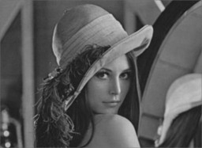|  |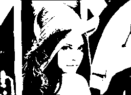|
|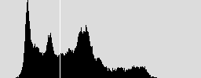|  ||
|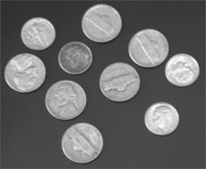|  |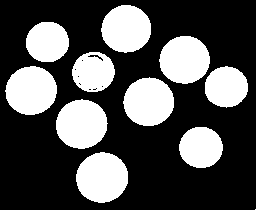|
|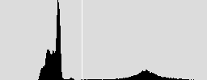|  |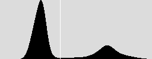|

<span id=ThresholdBasedOnTwoHumped>基于双峰平均值的阈值</span>
----------------------------------------------------------
1. 描述

	该算法和基于谷底最小值的阈值方法类似，只是最后一步不是取得双峰之间的谷底值，而是取双峰的平均值作为阈值。

2. 参考代码

```matlab
public static int GetIntermodesThreshold(int[] HistGram)
{
	int Y, Iter = 0, Index;
	double[] HistGramC = new double[256];           // 基于精度问题，一定要用浮点数来处理，否则得不到正确的结果
	double[] HistGramCC = new double[256];          // 求均值的过程会破坏前面的数据，因此需要两份数据
	for (Y = 0; Y < 256; Y++)
	{
		HistGramC[Y] = HistGram[Y];
		HistGramCC[Y] = HistGram[Y];
	}
	// 通过三点求均值来平滑直方图
	while (IsDimodal(HistGramCC) == false)                                                  // 判断是否已经是双峰的图像了
	{
		HistGramCC[0] = (HistGramC[0] + HistGramC[0] + HistGramC[1]) / 3;                   // 第一点
		for (Y = 1; Y < 255; Y++)
			HistGramCC[Y] = (HistGramC[Y - 1] + HistGramC[Y] + HistGramC[Y + 1]) / 3;       // 中间的点
		HistGramCC[255] = (HistGramC[254] + HistGramC[255] + HistGramC[255]) / 3;           // 最后一点
		System.Buffer.BlockCopy(HistGramCC, 0, HistGramC, 0, 256 * sizeof(double));         // 备份数据，为下一次迭代做准备
		Iter++;
		if (Iter >= 10000) return -1;                                                       // 似乎直方图无法平滑为双峰的，返回错误代码
	}
   // 阈值为两峰值的平均值
	int[] Peak = new int[2];
	for (Y = 1, Index = 0; Y < 255; Y++)
		if (HistGramCC[Y - 1] < HistGramCC[Y] && HistGramCC[Y + 1] < HistGramCC[Y]) Peak[Index++] = Y - 1;
	return ((Peak[0] + Peak[1]) / 2);
}
```

3. 效果

|原图                                  |   |                      二值图|
|------------------------------------------------|---|-----------------------------------------------|
||  ||
|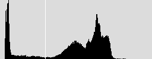|  |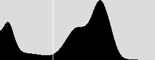|


<span id=IterativeOptimumThreshold>迭代最佳阈值</span>
---------------------------------------------------
1. 描述

	该算法先假定一个阈值，然后计算在该阈值下的前景和背景的中心值，当前景和背景中心值得平均值和假定的阈值相同时，则迭代中止，并以此值为阈值进行二值化。

2. 实现过程

(1). 求出图象的最大灰度值和最小灰度值，分别记为gl和gu，令初始阈值为

$$ T^0 = \frac {g_i + g_u} {2} $$

(2). 根据阈值T0将图象分割为前景和背景，分别求出两者的平均灰度值Ab和Af


$$ Sum1=\sum_{g=g_i}^{T^0} g \times h(g)  $$

$$ Sum2=\sum_{g=g_i}^{T^0} h(g)  $$

$$ A0 = \frac{Sum_1}{Sum_2} $$

(3). 如果 $T^k=T^k+1$,则取 $T^k$ 为所求得的阈值，否则，转2继续迭代。

$$ T^k=\frac{A_b + A_f}{2} $$

3. 参考代码

```matlab

public static int GetIterativeBestThreshold(int[] HistGram)
{
	int X, Iter = 0;
	int MeanValueOne, MeanValueTwo, SumOne, SumTwo, SumIntegralOne, SumIntegralTwo;
	int MinValue, MaxValue;
	int Threshold, NewThreshold;

	for (MinValue = 0; MinValue < 256 && HistGram[MinValue] == 0; MinValue++) ;
	for (MaxValue = 255; MaxValue > MinValue && HistGram[MinValue] == 0; MaxValue--) ;

	if (MaxValue == MinValue) return MaxValue;          // 图像中只有一个颜色
	if (MinValue + 1 == MaxValue) return MinValue;      // 图像中只有二个颜色

	Threshold = MinValue;
	NewThreshold = (MaxValue + MinValue) >> 1;
	while (Threshold != NewThreshold)    // 当前后两次迭代的获得阈值相同时，结束迭代
	{
		SumOne = 0; SumIntegralOne = 0;
		SumTwo = 0; SumIntegralTwo = 0;
		Threshold = NewThreshold;
		for (X = MinValue; X <= Threshold; X++)         //根据阈值将图像分割成目标和背景两部分，求出两部分的平均灰度值
		{
			SumIntegralOne += HistGram[X] * X;
			SumOne += HistGram[X];
		}
		MeanValueOne = SumIntegralOne / SumOne;
		for (X = Threshold + 1; X <= MaxValue; X++)
		{
			SumIntegralTwo += HistGram[X] * X;
			SumTwo += HistGram[X];
		}
		MeanValueTwo = SumIntegralTwo / SumTwo;
		NewThreshold = (MeanValueOne + MeanValueTwo) >> 1;       //求出新的阈值
		Iter++;
		if (Iter >= 1000) return -1;
	}
	return Threshold;
}

```
4. 效果

|原图                                  |   |                      二值图|
|------------------------------------------------|---|-----------------------------------------------|
|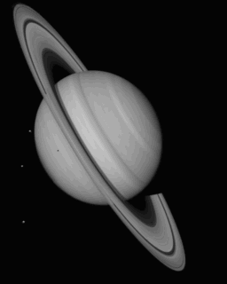|  |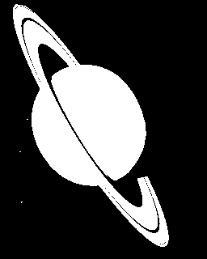|
||  | |
|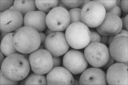|  |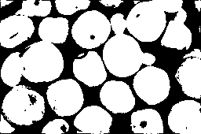|
|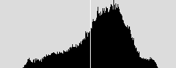|  | |

<span id=OSTU>OSTU大律法</span>
-----------------------------

1. 描述

	该算法是1979年由日本大津提出的，主要是思想是取某个阈值，使得前景和背景两类的类间方差最大，matlab中的graythresh即是以该算法为原理执行的。

2. 原理

	关于该算法的原理，网络上有很多，这里为了篇幅有限，不加以赘述。

3. 参考代码

```matlab
public static int GetOSTUThreshold(int[] HistGram)
{
	int X, Y, Amount = 0;
	int PixelBack = 0, PixelFore = 0, PixelIntegralBack = 0, PixelIntegralFore = 0, PixelIntegral = 0;
	double OmegaBack, OmegaFore, MicroBack, MicroFore, SigmaB, Sigma;              // 类间方差;
	int MinValue, MaxValue;
	int Threshold = 0;

	for (MinValue = 0; MinValue < 256 && HistGram[MinValue] == 0; MinValue++) ;
	for (MaxValue = 255; MaxValue > MinValue && HistGram[MinValue] == 0; MaxValue--) ;
	if (MaxValue == MinValue) return MaxValue;          // 图像中只有一个颜色
	if (MinValue + 1 == MaxValue) return MinValue;      // 图像中只有二个颜色

	for (Y = MinValue; Y <= MaxValue; Y++) Amount += HistGram[Y];        //  像素总数

	PixelIntegral = 0;
	for (Y = MinValue; Y <= MaxValue; Y++) PixelIntegral += HistGram[Y] * Y;
	SigmaB = -1;
	for (Y = MinValue; Y < MaxValue; Y++)
	{
		PixelBack = PixelBack + HistGram[Y];
		PixelFore = Amount - PixelBack;
		OmegaBack = (double)PixelBack / Amount;
		OmegaFore = (double)PixelFore / Amount;
		PixelIntegralBack += HistGram[Y] * Y;
		PixelIntegralFore = PixelIntegral - PixelIntegralBack;
		MicroBack = (double)PixelIntegralBack / PixelBack;
		MicroFore = (double)PixelIntegralFore / PixelFore;
		Sigma = OmegaBack * OmegaFore * (MicroBack - MicroFore) * (MicroBack - MicroFore);
		if (Sigma > SigmaB)
		{
			SigmaB = Sigma;
			Threshold = Y;
		}
	}
	return Threshold;
}
```

4. 效果

|原图                                  |   |                      二值图|
|------------------------------------------------|---|-----------------------------------------------|
|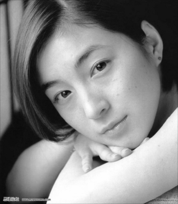|  |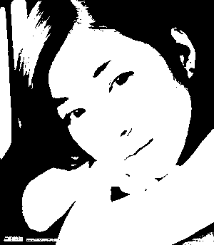|
|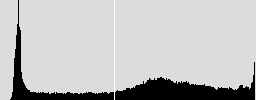|  | |


<span id=OneDimensionalMaximumEntropy>一维最大熵</span>
-----------------------------------------------------

1. 描述

	该算法把信息论中熵的概念引入到图像中，通过计算阈值分割后两部分熵的和来判断阈值是否为最佳阈值。

2. 算法原理

	这方面的文章也比较多，留给读者自行去查找相关资料。

3. 参考代码

```matlab
public static int Get1DMaxEntropyThreshold(int[] HistGram)
{
	int  X, Y,Amount=0;
	double[] HistGramD = new double[256];
	double SumIntegral, EntropyBack, EntropyFore, MaxEntropy;
	int MinValue = 255, MaxValue = 0;
	int Threshold = 0;

	for (MinValue = 0; MinValue < 256 && HistGram[MinValue] == 0; MinValue++) ;
	for (MaxValue = 255; MaxValue > MinValue && HistGram[MinValue] == 0; MaxValue--) ;
	if (MaxValue == MinValue) return MaxValue;          // 图像中只有一个颜色
	if (MinValue + 1 == MaxValue) return MinValue;      // 图像中只有二个颜色

	for (Y = MinValue; Y <= MaxValue; Y++) Amount += HistGram[Y];        //  像素总数

	for (Y = MinValue; Y <= MaxValue; Y++)   HistGramD[Y] = (double)HistGram[Y] / Amount+1e-17;

	MaxEntropy = double.MinValue; ;
	for (Y = MinValue + 1; Y < MaxValue; Y++)
	{
		SumIntegral = 0;
		for (X = MinValue; X <= Y; X++) SumIntegral += HistGramD[X];
		EntropyBack = 0;
		for (X = MinValue; X <= Y; X++) EntropyBack += (-HistGramD[X] / SumIntegral * Math.Log(HistGramD[X] / SumIntegral));
		EntropyFore = 0;
		for (X = Y + 1; X <= MaxValue; X++) EntropyFore += (-HistGramD[X] / (1 - SumIntegral) * Math.Log(HistGramD[X] / (1 - SumIntegral)));
		if (MaxEntropy < EntropyBack + EntropyFore)
		{
			Threshold = Y;
			MaxEntropy = EntropyBack + EntropyFore;
		}
	}
	return Threshold;
}

```
<span id=MomentKeepingMethod>力矩保持法</span>
--------------------------------------------

1. 描述

	该算法通过选择恰当的阈值从而使得二值后的图像和原始的灰度图像具有三个相同的初始力矩值。

2. 原理

参考论文：*W. Tsai, “Moment-preserving thresholding: a new approach,” Comput.Vision Graphics Image Process., vol. 29, pp. 377-393, 1985.*
由于无法下载到该论文（收费的），仅仅给出从其他一些资料中找到的公式共享一下。


$ x_0 = \frac{1}{2} - \frac{B_n / A_n + x_2 / 2}{\sqrt{x_2^2 - 4x_1}} $

$ x_1 = \frac{B_nD_n - C_n^2}{A_nC_n-B_n^2} $

$ x_2 = \frac{B_nC_n - A_nD_n}{A_nC_n-B_n^2} $

$ Dn=\sum_{i=0}^{n} i^2y_i $


其中的A\B\C的函数可见代码部分。


3. 参考代码

```matlab
public static byte GetMomentPreservingThreshold(int[] HistGram)
{
	int X, Y, Index = 0, Amount=0;
	double[] Avec = new double[256];
	double X2, X1, X0, Min;

	for (Y = 0; Y <= 255; Y++) Amount += HistGram[Y];        //  像素总数
	for (Y = 0; Y < 256; Y++) Avec[Y] = (double)A(HistGram, Y) / Amount;       // The threshold is chosen such that A(y,t)/A(y,n) is closest to x0.

	// The following finds x0.

	X2 = (double)(B(HistGram, 255) * C(HistGram, 255) - A(HistGram, 255) * D(HistGram, 255)) / (double)(A(HistGram, 255) * C(HistGram, 255) - B(HistGram, 255) * B(HistGram, 255));
	X1 = (double)(B(HistGram, 255) * D(HistGram, 255) - C(HistGram, 255) * C(HistGram, 255)) / (double)(A(HistGram, 255) * C(HistGram, 255) - B(HistGram, 255) * B(HistGram, 255));
	X0 = 0.5 - (B(HistGram, 255) / A(HistGram, 255) + X2 / 2) / Math.Sqrt(X2 * X2 - 4 * X1);

	for (Y = 0, Min = double.MaxValue; Y < 256; Y++)
	{
		if (Math.Abs(Avec[Y] - X0) < Min)
		{
			Min = Math.Abs(Avec[Y] - X0);
			Index = Y;
		}
	}
	return (byte)Index;
}

private static double A(int[] HistGram, int Index)
{
	double Sum = 0;
	for (int Y = 0; Y <= Index; Y++)
		Sum += HistGram[Y];
	return Sum;
}

private static double B(int[] HistGram, int Index)
{
	double Sum = 0;
	for (int Y = 0; Y <= Index; Y++)
		Sum += (double)Y * HistGram[Y];
	return Sum;
}

private static double C(int[] HistGram, int Index)
{
	double Sum = 0;
	for (int Y = 0; Y <= Index; Y++)
		Sum += (double)Y * Y * HistGram[Y];
	return Sum;
}

private static double D(int[] HistGram, int Index)
{
	double Sum = 0;
	for (int Y = 0; Y <= Index; Y++)
		Sum += (double)Y * Y * Y * HistGram[Y];
	return Sum;
}

```
对于很多图像，该算法页能取得比较满意的结果。

<span id=ThresholdBasedOnFuzzy>基于模糊集理论的阈值</span>
------------------------------------------------------
此法也借用香农熵的概念，该算法一般都能获得较为理想的分割效果，不管是对双峰的还是单峰的图像。
这是篇很古老的论文中的算法，发表与1994年，是清华大学黄良凯（Liang-kai Huang) 所写，因此国外一些论文里和代码里称之为Huang's fuzzy thresholding method。

该论文的原文可从此处下载： [Image thresholding by minimizing the measure of fuzziness](http://www.ktl.elf.stuba.sk/study/vacso/Zadania-Cvicenia/Cvicenie_3/TimA2/Huang_E016529624.pdf)。
该论文结合了当时处于研究热潮的模糊集理论，提出了一种具有较好效果的图像二值化算法，本文主要是对其进行简单的翻译和注释，并提供了测试代码。
1.  模糊集及其隶属度函数
	首先，我们假定X代表一副大小为M×N的具有L个色阶的灰度图像，而xmn代表图像X中点（m,n)处的像素灰度值，定义μx(xmn)表示该点具有某种属性的隶属度值，也就是说我们定义了一个从图像X映射到[0,1]区间的模糊子集，用专业的模糊集表达，即有:

$$ P=x_{mn}, X=\\{ A,u_X(P) \\}$$

其中0≤μx(xmn)≤1，m=0,1,...M-1，n=0,1,...N-1。对于二值化来说，每个像素对于其所属的类别（前景或背景）都应该有很相近的关系，因此，我们可以这种关系来表示μx(xmn)的值。
定义h(g)表示图像中具有灰度级g的像素的个数，对于一个给定的阈值t,背景和前景各自色阶值的平均值$u_0$和$u_1$可用下式表示


$$ b0=\sum_{g=0}^{t} gh(g)$$

$$ c0=\sum_{g=0}^{t} h(g) $$

$ u_0=b0/c0   $ ....................(2)


$$ b1=\sum_{g=t+1}^{L-1} gh(g) $$

$$ c1=\sum_{g=t+1}^{L-1} h(g) $$

$ u_1 = b1 / c1 $ ....................(3)


上述μ0和μ1，可以看成是指定阈值t所对应的前景和背景的目标值，而图像X中某一点和其所述的区域之间的关系，在直觉上应该和该点的色阶值与所属区域的目标值之间的差异相关。因此，对于点(m,n)，我们提出如下的隶属度定义函数：

$$
 u_X(P) =
\\begin{cases}
\frac{1}{1 + |P - u_0| / C}                           & \text {if $P \\le t$} \\\\
\frac{1}{1 + |P - u_1| / C}                           & \text {if $P \\gt t$} \\\\
\end{cases}
$$

其中C是一个常数，该常数使得$0.5≤μx(xmn)≤1。因此，对于一个给定的阈值t，图像中任何一个像素要么属于背景，要么属于前景，因此，每个像素的隶属度不应小于0.5。

C值在实际的编程中，可以用图像的最大灰度值减去最小灰度值来表达，即

$ x=g_{max} $

$ y=g_{min} $

$ C=x - y $

2.  模糊度的度量及取阈值的原则
模糊度表示了一个模糊集的模糊程度，有好几种度量方式已经被提及了，本文仅仅使用了香农熵函数来度量模糊度。
基于香农熵函数，一个模糊集A的熵定义为

$$ E(A)=\\frac{1}{nln2}\\sum_{i}S(u_A(x_i)) \\text{  i=1,2,...n} $$

其中香农函数

$$u_A(x_i)=-u_A(x_i)ln[u_A(x_i)] - [1 - u_A(x_i)]ln[1 - u_A(x_i)] $$

扩展到2维的图像，图像X的熵可以表达为

$$ E(X)=\\frac{1}{MNln2} \sum_m\sum_nS(u_x(P)) \\text{ m=0,1...M-1 and n=0,1...N-1}$$

因为灰度图像至多只有L个色阶，因此使用直方图式（7）可进一步写成

$$ E(X)=\\frac{1}{MNln2} \sum_gS(u_x(g))h(g) \\text{ g=0,1...L-1 } $$

可以证明式（6）在区间[0,0.5]之间是单调递增而在[0.5,1]之间是单调递减的，并且E(X)具有以下属性：

	(1). 0≤E(X)≤1
	(2). 如果μx(xmn)=0或者μx(xmn)=1时，E(X)具有最小值0，在本文中μx(xmn)只可能为1，此时分类具有最好的明确性。
	(3). 当μx(xmn)=0.5，E(X)获得最大值1，此时的分类具有最大的不明确性。

那么对于图像X，我们确定最好的阈值t的原则就是：对于所有的可能的阈值t,取香农熵值最小时的那个t为最终的分割阈值。

3.  编程中的技巧
有了上述原理，其实编程也是件很容易的事情了，你可以按照你的想法去做，不过作者论文中的阐述会让代码写起来更清晰、更有效。
首先，为了表达方便，我们定义如下一些表达式

$$ S(t)=\\sum_{g=0}^{t}h(g) $$

$$ nS(t)=\\sum_{g=t+1}^{L-1}h(g) $$

$$ W(t)=\\sum_{g=0}^{t}gh(g) $$

$$ nW(t)=\\sum_{g=t+1}^{L-1}gh(g) $$

根据上述表达式，可以知道S(L-1)及W(L-1)对于一副图像来说是个常量，其中S(L-1)明显就是像素的总个数。

**我们的算法步骤如下**

1). 计算S(L-1)、W(L-1)，设置初始阈值t=gmin,令S(t-1)=0、W(t-1)=0;
2). 计算下面算式:

$$ S(t)=S(t-1)+h(t) $$

$$ nS(t)=S(L-1)+S(t) $$

$$ W(t)=W(t-1)+ t \\times h(t) $$

$$ nW(t)=W(L-1)+W(t) $$

稍微有点数学基础的人都应该能看懂上述算式的推导原理。
根据式 2) 和式3)，可以知道背景和前景的区域的平均灰度值为：

上式中int表示取整操作。
3). 根据式（4）及式（11）计算图像的模糊度;
4). 令t=t+1，然后重新执行步骤2，直到t=gmax-1;
5). 找到整个过程中的最小模糊度值对应的阈值t，并作为最佳的分割阈值。

为了稍微加快点速度，上述式4中的计算可以在步骤1中用一查找表实现。


4.  参考代码

```matlab
public static int GetHuangFuzzyThreshold(int[] HistGram)
{
    int X, Y;
    int First, Last;
    int Threshold = -1;
    double BestEntropy = Double.MaxValue, Entropy;
    //   找到第一个和最后一个非0的色阶值
    for (First = 0; First < HistGram.Length && HistGram[First] == 0; First++) ;
    for (Last = HistGram.Length - 1; Last > First && HistGram[Last] == 0; Last--) ;
    if (First == Last) return First;                // 图像中只有一个颜色
    if (First + 1 == Last) return First;            // 图像中只有二个颜色

    // 计算累计直方图以及对应的带权重的累计直方图
    int[] S = new int[Last + 1];
    int[] W = new int[Last + 1];            // 对于特大图，此数组的保存数据可能会超出int的表示范围，可以考虑用long类型来代替
    S[0] = HistGram[0];
    for (Y = First > 1 ? First : 1; Y <= Last; Y++)
    {
        S[Y] = S[Y - 1] + HistGram[Y];
        W[Y] = W[Y - 1] + Y * HistGram[Y];
    }

    // 建立公式（4）及（6）所用的查找表
    double[] Smu = new double[Last + 1 - First];
    for (Y = 1; Y < Smu.Length; Y++)
    {
        double mu = 1 / (1 + (double)Y / (Last - First));               // 公式（4）
        Smu[Y] = -mu * Math.Log(mu) - (1 - mu) * Math.Log(1 - mu);      // 公式（6）
    }

    // 迭代计算最佳阈值
    for (Y = First; Y <= Last; Y++)
    {
        Entropy = 0;
        int mu = (int)Math.Round((double)W[Y] / S[Y]);             // 公式17
        for (X = First; X <= Y; X++)
            Entropy += Smu[Math.Abs(X - mu)] * HistGram[X];
        mu = (int)Math.Round((double)(W[Last] - W[Y]) / (S[Last] - S[Y]));  // 公式18
        for (X = Y + 1; X <= Last; X++)
            Entropy += Smu[Math.Abs(X - mu)] * HistGram[X];       // 公式8
        if (BestEntropy > Entropy)
        {
            BestEntropy = Entropy;      // 取最小熵处为最佳阈值
            Threshold = Y;
        }
    }
    return Threshold;
}
```

5. 效果

|原图                                  |   |                      二值图|
|------------------------------------------------|---|-----------------------------------------------|
||  ||
||  |  |

<span id=Kittler>Kittler最小错误分类法</span>
------------------------------------------

该算法具体的分析见:

	*Kittler, J & Illingworth, J (1986), "Minimum error thresholding", Pattern Recognition 19: 41-47*

从实际的运行效果看，该算法并不很好。

参考代码：

```matlab
public static int GetKittlerMinError(int[] HistGram)
{
	int X, Y;
	int MinValue, MaxValue;
	int Threshold ;
	int PixelBack, PixelFore;
	double OmegaBack, OmegaFore, MinSigma, Sigma, SigmaBack, SigmaFore;
	for (MinValue = 0; MinValue < 256 && HistGram[MinValue] == 0; MinValue++) ;
	for (MaxValue = 255; MaxValue > MinValue && HistGram[MinValue] == 0; MaxValue--) ;
	if (MaxValue == MinValue) return MaxValue;          // 图像中只有一个颜色
	if (MinValue + 1 == MaxValue) return MinValue;      // 图像中只有二个颜色
	Threshold = -1;
	MinSigma = 1E+20;
	for (Y = MinValue; Y < MaxValue; Y++)
	{
		PixelBack = 0; PixelFore = 0;
		OmegaBack = 0; OmegaFore = 0;
		for (X = MinValue; X <= Y; X++)
		{
			PixelBack += HistGram[X];
			OmegaBack = OmegaBack + X * HistGram[X];
		}
		for (X = Y + 1; X <= MaxValue; X++)
		{
			PixelFore += HistGram[X];
			OmegaFore = OmegaFore + X * HistGram[X];
		}
		OmegaBack = OmegaBack / PixelBack;
		OmegaFore = OmegaFore / PixelFore;
		SigmaBack = 0; SigmaFore = 0;
		for (X = MinValue; X <= Y; X++) SigmaBack = SigmaBack + (X - OmegaBack) * (X - OmegaBack) * HistGram[X];
		for (X = Y + 1; X <= MaxValue; X++) SigmaFore = SigmaFore + (X - OmegaFore) * (X - OmegaFore) * HistGram[X];
		if (SigmaBack == 0 || SigmaFore == 0)
		{
			if (Threshold == -1)
				Threshold = Y;
		}
		else
		{
			SigmaBack = Math.Sqrt(SigmaBack / PixelBack);
			SigmaFore = Math.Sqrt(SigmaFore / PixelFore);
			Sigma = 1 + 2 * (PixelBack * Math.Log(SigmaBack / PixelBack) + PixelFore * Math.Log(SigmaFore / PixelFore));
			if (Sigma < MinSigma)
			{
				MinSigma = Sigma;
				Threshold = Y;
			}
		}
	}
	return Threshold;
}
```

<span id=intermeans>ISODATA(也叫做intermeans法）</span>
-----------------------------------------------------

参考论文：

    *Ridler, TW & Calvard, S (1978), "Picture thresholding using an iterative selection method", IEEE Transactions on Systems, Man and Cybernetics 8: 630-632, <http://ieeexplore.ieee.org/xpls/abs_all.jsp?arnumber=4310039>*

参考代码:

```matlab
// Also called intermeans
// Iterative procedure based on the isodata algorithm [T.W. Ridler, S. Calvard, Picture
// thresholding using an iterative selection method, IEEE Trans. System, Man and
// Cybernetics, SMC-8 (1978) 630-632.]
// The procedure divides the image into objects and background by taking an initial threshold,
// then the averages of the pixels at or below the threshold and pixels above are computed.
// The averages of those two values are computed, the threshold is incremented and the
// process is repeated until the threshold is larger than the composite average. That is,
//  threshold = (average background + average objects)/2
// The code in ImageJ that implements this function is the getAutoThreshold() method in the ImageProcessor class.
//
// From: Tim Morris (dtm@ap.co.umist.ac.uk)
// Subject: Re: Thresholding method?
// posted to sci.image.processing on 1996/06/24
// The algorithm implemented in NIH Image sets the threshold as that grey
// value, G, for which the average of the averages of the grey values
// below and above G is equal to G. It does this by initialising G to the
// lowest sensible value and iterating:

// L = the average grey value of pixels with intensities < G
// H = the average grey value of pixels with intensities > G
// is G = (L + H)/2?
// yes => exit
// no => increment G and repeat
//
// There is a discrepancy with IJ because they are slightly different methods

public static int GetIsoDataThreshold(int[] HistGram)
{
	int i, l, toth, totl, h, g = 0;
	for (i = 1; i < HistGram.Length; i++)
	{
		if (HistGram[i] > 0)
		{
			g = i + 1;
			break;
		}
	}
	while (true)
	{
		l = 0;
		totl = 0;
		for (i = 0; i < g; i++)
		{
			totl = totl + HistGram[i];
			l = l + (HistGram[i] * i);
		}
		h = 0;
		toth = 0;
		for (i = g + 1; i < HistGram.Length; i++)
		{
			toth += HistGram[i];
			h += (HistGram[i] * i);
		}
		if (totl > 0 && toth > 0)
		{
			l /= totl;
			h /= toth;
			if (g == (int)Math.Round((l + h) / 2.0))
				break;
		}
		g++;
		if (g > HistGram.Length - 2)
		{
			return 0;
		}
	}
	return g;
}
```

<span id=Shanbhag>Shanbhag 法</span>
-----------------------------------

参考论文：

	*Shanbhag, Abhijit G. (1994), "Utilization of information measure as a means of image thresholding", Graph. Models Image Process. (Academic Press, Inc.) 56 (5): 414--419, ISSN 1049-9652, DOI 10.1006/cgip.1994.1037*

参考代码:

```matlab

public static int GetShanbhagThreshold(int[] HistGram)
{
	int threshold;
	int ih, it;
	int first_bin;
	int last_bin;
	double term;
	double tot_ent;  /* total entropy */
	double min_ent;  /* max entropy */
	double ent_back; /* entropy of the background pixels at a given threshold */
	double ent_obj;  /* entropy of the object pixels at a given threshold */
	double[] norm_histo = new double[HistGram.Length]; /* normalized histogram */
	double[] P1 = new double[HistGram.Length]; /* cumulative normalized histogram */
	double[] P2 = new double[HistGram.Length];

	int total = 0;
	for (ih = 0; ih < HistGram.Length; ih++)
		total += HistGram[ih];

	for (ih = 0; ih < HistGram.Length; ih++)
		norm_histo[ih] = (double)HistGram[ih] / total;

	P1[0] = norm_histo[0];
	P2[0] = 1.0 - P1[0];
	for (ih = 1; ih < HistGram.Length; ih++)
	{
		P1[ih] = P1[ih - 1] + norm_histo[ih];
		P2[ih] = 1.0 - P1[ih];
	}

	/* Determine the first non-zero bin */
	first_bin = 0;
	for (ih = 0; ih < HistGram.Length; ih++)
	{
		if (!(Math.Abs(P1[ih]) < 2.220446049250313E-16))
		{
			first_bin = ih;
			break;
		}
	}

	/* Determine the last non-zero bin */
	last_bin = HistGram.Length - 1;
	for (ih = HistGram.Length - 1; ih >= first_bin; ih--)
	{
		if (!(Math.Abs(P2[ih]) < 2.220446049250313E-16))
		{
			last_bin = ih;
			break;
		}
	}

	// Calculate the total entropy each gray-level
	// and find the threshold that maximizes it
	threshold = -1;
	min_ent = Double.MaxValue;

	for (it = first_bin; it <= last_bin; it++)
	{
		/* Entropy of the background pixels */
		ent_back = 0.0;
		term = 0.5 / P1[it];
		for (ih = 1; ih <= it; ih++)
		{ //0+1?
			ent_back -= norm_histo[ih] * Math.Log(1.0 - term * P1[ih - 1]);
		}
		ent_back *= term;

		/* Entropy of the object pixels */
		ent_obj = 0.0;
		term = 0.5 / P2[it];
		for (ih = it + 1; ih < HistGram.Length; ih++)
		{
			ent_obj -= norm_histo[ih] * Math.Log(1.0 - term * P2[ih]);
		}
		ent_obj *= term;

		/* Total entropy */
		tot_ent = Math.Abs(ent_back - ent_obj);

		if (tot_ent < min_ent)
		{
			min_ent = tot_ent;
			threshold = it;
		}
	}
	return threshold;
}
```

<span id=Yen>Yen法</span>
------------------------

参考论文：

     *1).  Yen J.C., Chang F.J., and Chang S. (1995) "A New Criterion  for Automatic Multilevel Thresholding" IEEE Trans. on Image  Processing, 4(3): 370-378*
    
     *2).  Sezgin M. and Sankur B. (2004) "Survey over Image Thresholding Techniques and Quantitative Performance Evaluation" Journal of  Electronic Imaging, 13(1): 146-165*

参考代码:

```matlab
// M. Emre Celebi
// 06.15.2007
// Ported to ImageJ plugin by G.Landini from E Celebi's fourier_0.8 routines
public static int GetYenThreshold(int[] HistGram)
{
	int threshold;
	int ih, it;
	double crit;
	double max_crit;
	double[] norm_histo = new double[HistGram.Length]; /* normalized histogram */
	double[] P1 = new double[HistGram.Length]; /* cumulative normalized histogram */
	double[] P1_sq = new double[HistGram.Length];
	double[] P2_sq = new double[HistGram.Length];

	int total = 0;
	for (ih = 0; ih < HistGram.Length; ih++)
		total += HistGram[ih];

	for (ih = 0; ih < HistGram.Length; ih++)
		norm_histo[ih] = (double)HistGram[ih] / total;

	P1[0] = norm_histo[0];
	for (ih = 1; ih < HistGram.Length; ih++)
		P1[ih] = P1[ih - 1] + norm_histo[ih];

	P1_sq[0] = norm_histo[0] * norm_histo[0];
	for (ih = 1; ih < HistGram.Length; ih++)
		P1_sq[ih] = P1_sq[ih - 1] + norm_histo[ih] * norm_histo[ih];

	P2_sq[HistGram.Length - 1] = 0.0;
	for (ih = HistGram.Length - 2; ih >= 0; ih--)
		P2_sq[ih] = P2_sq[ih + 1] + norm_histo[ih + 1] * norm_histo[ih + 1];

	/* Find the threshold that maximizes the criterion */
	threshold = -1;
	max_crit = Double.MinValue;
	for (it = 0; it < HistGram.Length; it++)
	{
		crit = -1.0 * ((P1_sq[it] * P2_sq[it]) > 0.0 ? Math.Log(P1_sq[it] * P2_sq[it]) : 0.0) + 2 * ((P1[it] * (1.0 - P1[it])) > 0.0 ? Math.Log(P1[it] * (1.0 - P1[it])) : 0.0);
		if (crit > max_crit)
		{
			max_crit = crit;
			threshold = it;
		}
	}
	return threshold;
}
```
参考：http://fiji.sc/wiki/index.php/Auto_Threshold  这里获得更多的信息。


Sobel算子
========

计算机视觉领域的一种重要处理方法。主要用于获得数字图像的一阶梯度，常见的应用和物理意义是边缘检测。在技术上，它是一个离散的一阶差分算子，用来计算图像亮度函数的一阶梯度之近似值。在图像的任何一点使用此算子，将会产生该点对应的梯度矢量或是其法矢量

对于已经写入数字图像处理及机器视觉教科书多年的Sobel算子，谁也没曾追问和关心过它的发明背景和历史。最近，给学生上“光电图像处理”课，想介绍一下该算子的来历，查了很多文献，就是找不到原始文献。Google学术里搜索，信息很多，却不一致。有标注为期刊论文的，也有标注出版物析出的，出版时间也不一致（冈萨雷斯《Digital Image Processing》教材标注的时间为1970年）。

这个看似简单，但领域内科研、开发人员沿用了几十年的边缘检测算子究竟如何产生的？偶然发现了一个帖子，该算子的提出者Irwin Sobel在算子产生多年后于该帖中详细谈到它的由来和定义。

原来，这个著名的Sobel边缘算子，当年作者并没有公开发表过论文，仅仅是在一次博士生课题讨论会(1968)上提出("A 3x3 Isotropic Gradient Operator for Image Processing")，后在1973年出版的一本专著（"Pattern Classification and Scene Analysis"）的脚注里作为注释出现和公开的。


核心公式
-------

该算子包含两组3x3的矩阵，分别为横向及纵向，将之与图像作平面卷积，即可分别得出横向及纵向的亮度差分近似值。如果以A代表原始图像，Gx及Gy分别代表经横向及纵向边缘检测的图像，其公式如下:

$$ G_x = \\left[\\begin{matrix}
-1 & 0 & 1 \\\\
-2 & 0 & 2 \\\\
-1 & 0 & 1
\\end{matrix}\\right] \\times A$$

$$ G_y = \\left[\\begin{matrix}
-1 & -2 & -1 \\\\
 0 &  0 &  0 \\\\
 1 &  2 &  1
	\\end{matrix}\\right] \\times A$$

图像的每一个像素的横向及纵向梯度近似值可用以下的公式结合，来计算梯度的大小。

$$ G = \\sqrt{G_x^2 + G_y^2} $$

可用以下公式计算梯度方向。

$$ \\theta = arctan\\left( \\frac{G_y}{G_x} \\right) $$

在以上例子中，如果以上的角度$\\theta$等于零，即代表图像该处拥有纵向边缘，左方较右方暗。

算子描述
------

在边缘检测中，常用的一种模板是Sobel 算子。Sobel 算子有两个，一个是检测水平边缘的 ；另一个是检测垂直边缘的 。与Prewitt算子相比，Sobel算子对于像素的位置的影响做了加权，可以降低边缘模糊程度，因此效果更好。

Sobel算子另一种形式是各向同性Sobel(Isotropic Sobel)算子，也有两个，一个是检测水平边缘的 ，另一个是检测垂直边缘的 。各向同性Sobel算子和普通Sobel算子相比，它的位置加权系数更为准确，在检测不同方向的边沿时梯度的幅度一致。将Sobel算子矩阵中的所有2改为根号2，就能得到各向同性Sobel的矩阵。

由于Sobel算子是滤波算子的形式，用于提取边缘，可以利用快速卷积函数， 简单有效，因此应用广泛。美中不足的是，Sobel算子并没有将图像的主体与背景严格地区分开来，换言之就是Sobel算子没有基于图像灰度进行处理，由于Sobel算子没有严格地模拟人的视觉生理特征，所以提取的图像轮廓有时并不能令人满意。 在观测一幅图像的时候，我们往往首先注意的是图像与背景不同的部分，正是这个部分将主体突出显示，基于该理论，我们给出了下面阈值化轮廓提取算法，该算法已在数学上证明当像素点满足正态分布时所求解是最优的。

参考：http://baike.baidu.com/link?url=frWZtRRbQwuJoNlW1KIugyZ_MHG-qzV3j0ndCaaDfpG5znYGQE9UryiDuMY0Z4O-dASSRKOnlsvjtoOPvgz3CuX8J9Xle7DllXzBwGoQrISHGYph3ID3VDGj-JFOKWmV


关于HaarDetection.
-----------------

一. 在计算每个窗口的haar值时，使用CvHidHaarClassifierCascade结构的casecade，因此需要以下步骤。

	1. 创建CvHidHaarClassifierCascade结构对应的casecade。
	   即申请内存，并填写casecade中相关的头信息，如有多少个stage, 每个stage下有多少个tree，每个tree下有多少个node，以及相关的阈值等信息。
	   该操作调用的函数是icvCreateHidHaarClassifierCascade
	2. 填写每个haar feature对应的积分图中矩形框的指针。
	   包括casecade指向的积分图的指针sum,更多的是相应haar特征对应的矩形框指针以及权重。每个haar特征对应着2个或者3个带权重的矩形框，分别用p0,p1,p2,p3指向每个矩形框的四个顶点在积分图中的相应位置。
	   另外，这里haar特征对应的矩形框是根据窗口大小变化的。如样本是20*20，某个haar特征对应的某一个矩形框是4*4，当scanWindow的窗口放大为40*40时，该矩形框也扩大为8*8。
	   所有的矩形框顶点的指针都是基于原图的积分图的，当窗口缩放时，其haar特征对应的矩形框的顶点位置也会发生相应的缩放。
	   该操作调用的函数是cvSetImageForHaarClassifierCascade

二.  有了CvHidHaarClassifierCascade结构的casecade，就可以计算每个window对应的stage值了。实际上，在每一个window尺寸上创建好casecade后，就会计算该window大小下所有窗口的stage值，保存满足条件的那些窗口。然后再创建下一个缩放window尺寸上的casecade，并替换掉上一个尺寸的casecade，再计算新window大小下所有窗口的stage值，继续保存满足条件的那些窗口。如此循环，直至检测窗口小于样本尺寸，或者检测窗口大于原图尺寸。其中计算每个固定尺寸窗口的stage值的过程见三中详述。

三.  计算每一个window尺寸上所有窗口的stage值。将满足条件的窗口保存下来。这个过程用cvRunHaarClassifierCascadeSum函数判断，当cvRunHaarClassifierCascadeSum返回值大于0，才会保存此时检测的窗口位置，作为备选，参与后面的聚类过程。
	cvRunHaarClassifierCascadeSum函数调用icvEvalHidHaarClassifier来计算出每个树对应节点的haar特征值，然后再和该节点的阈值比较，如果小于阈值选择左边分支作为当前node的结果；否则选择右值作为当前node的结果；直至分支的索引小于等于0，此时得到的alpha为该树的计算结果。
	当用icvEvalHidHaarClassifier计算所有树的节点后，再判断所有树的累积和（所有树的alpha之和）是否大于stage阈值，如果大于阈值则返回1，否则返回负值。返回1，则再进行下一个stage计算，直至所有的stage计算完毕，并且每个累积和都大于每个stage相应的阈值，则cvRunHaarClassifierCascadeSum返回1。
	从上面可以看出，需要比较两次一个是node thresh的比较，一个是stage thresh的比较，比较node thresh时选择left_val或者right_val作为比较的结果，比较stage thresh时将所有的node结果累加起来，若累加结果大于stage thresh则算作通过比较，标记当前窗口是有效窗口。
	这时一个窗口计算完毕，保存此时检测的窗口位置，作为备选，参与后面的聚类过程。
	然后平移窗口，重复上述步骤，直至窗口移动到图像的右下边界。

四.  当所有满足尺寸要求的窗口遍历完毕，并将满足条件的窗口保存完毕后，再对保存的窗口进行聚类，和最小邻域过滤。


cvHaarDetectObjects
------------------
检测图像中的目标

```cpp
typedef struct CvAvgComp
{
    CvRect rect; /* bounding rectangle for the object (average rectangle of a group) */
    int neighbors; /* number of neighbor rectangles in the group */
}
CvAvgComp;

CvSeq* cvHaarDetectObjects( const CvArr* image, CvHaarClassifierCascade* cascade,
                            CvMemStorage* storage, double scale_factor=1.1,
                            int min_neighbors=3, int flags=0,
                            CvSize min_size=cvSize(0,0) );
```

	image：被检图像
	cascade：harr 分类器级联的内部标识形式
	storage：用来存储检测到的一序列候选目标矩形框的内存区域。
	scale_factor：在前后两次相继的扫描中，搜索窗口的比例系数。例如1.1指将搜索窗口依次扩大10%。
	min_neighbors：构成检测目标的相邻矩形的最小个数(缺省－1)。如果组成检测目标的小矩形的个数和小于min_neighbors-1 都会被排除。如果min_neighbors 为 0, 则函数不做任何操作就返回所有的被检候选矩形框，这种设定值一般用在用户自定义对检测结果的组合程序上。
	flags：操作方式。当前可以定义的操作方式是CV_HAAR_DO_CANNY_PRUNING(CANNY边缘检测)、CV_HAAR_SCALE_IMAGE(缩放图像检测)、CV_HAAR_FIND_BIGGEST_OBJECT(寻找最大的目标)、CV_HAAR_DO_ROUGH_SEARCH(做粗略搜索)。
	如果CV_HAAR_DO_CANNY_PRUNING被设定，函数利用Canny边缘检测器来排除一些边缘很少或者很多的图像区域，因为这样的区域一般不含被检目标。人脸检测中通过设定阈值使用了这种方法，并因此提高了检测速度。当然该标记是在没有定义CV_HAAR_SCALE_IMAGE下使用的，也就是说使用缩放检测窗口的形式定义的
	如果CV_HAAR_SCALE_IMAGE被设定则在每一个scale上缩放图像检测，如果没有定义则缩放检测窗口进行检测，当缩放检测窗口检测的时候是不能返回rejectLevels和levelWeights的。
	如果CV_HAAR_FIND_BIGGEST_OBJECT被设定，如果没有设定CV_HAAR_SCALE_IMAGE，保存当前检测窗口中面积最大的矩形，不管设定没有设定CV_HAAR_SCALE_IMAGE，最后都输出一个面积最大的矩形(如果检测结果不为空的话)，详细分析可以参考cvHaarDetectObjectsForROC
	如果CV_HAAR_DO_ROUGH_SEARCH设定了，则最小的缩放比例为0.6，否则为0.4，仅在缩放检测窗口中有效


```cpp
	if( findBiggestObject )
		flags &= ~(CV_HAAR_SCALE_IMAGE|CV_HAAR_DO_CANNY_PRUNING);
```

	从以上代码可以看出，寻找最大目标优先于缩放图像和边缘检测，也就是说如果同时定义了以上三项，则以寻找最大目标为准
	其次从代码结构上缩放图像在前缩放检测窗口在后，因此如果定义了缩放图像，则不进行边缘检测
	min_size：检测窗口的最小尺寸。缺省的情况下被设为分类器训练时采用的样本尺寸(人脸检测中缺省大小是~20×20)。
	函数 cvHaarDetectObjects 使用针对某目标物体训练的级联分类器在图像中找到包含目标物体的矩形区域，并且将这些区域作为一序列的矩形框返回。函数以不同比例大小的扫描窗口对图像进行几次搜索(察看cvSetImagesForHaarClassifierCascade)。 每次都要对图像中的这些重叠区域利用cvRunHaarClassifierCascade进行检测。 有时候也会利用某些继承（heuristics）技术以减少分析的候选区域，例如利用 Canny 裁减 （prunning）方法。 函数在处理和收集到候选的方框(全部通过级联分类器各层的区域)之后，接着对这些区域进行组合并且返回一系列各个足够大的组合中的平均矩形。调节程序中的缺省参数(scale_factor=1.1, min_neighbors=3, flags=0)用于对目标进行更精确同时也是耗时较长的进一步检测。为了能对视频图像进行更快的实时检测，参数设置通常是：scale_factor=1.2, min_neighbors=2, flags=CV_HAAR_DO_CANNY_PRUNING, min_size=<minimum possible face size> (例如, 对于视频会议的图像区域).


LapLace 拉普拉斯算子
=================

二维函数f(x,y)的拉普拉斯是一个二阶的微分，定义为：

$$
\\nabla^2 f =  \\frac{\\partial ^2 f}{\\partial x}  + \\frac{\\partial^2 f}{\\partial y}
$$

其中:

$$
\\frac{\\partial ^2 f}{\\partial x} = f[x+1,y] - 2f[x,y] + f[x-1,y]
$$

可以用多种方式将其表示为数字形式。对于一个3*3的区域，经验上被推荐最多的形式是：

$$
\\nabla^2 f = 4z_5 - (z_2 + z_4 + z_6 + z_8)
$$

定义数字形式的拉普拉斯要求系数之和必为0


注意，边缘检测对噪声比较敏感，需要先用高斯滤波器对图像进行平滑。参考博文：【OpenCV】邻域滤波：方框、高斯、中值、双边滤波

原图：


LapLace边缘检测:

