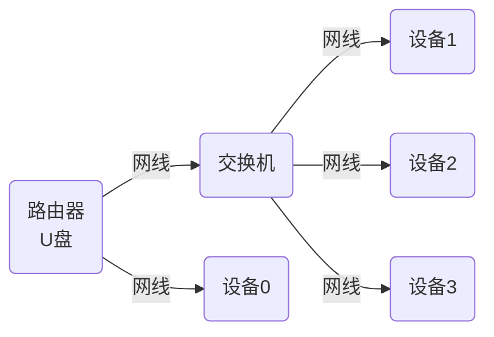

# FTP批量自动升级

适用对象：

- 开发测试人员
- 售前售后人员

## 硬件资源

- 一个带U盘存储和FTP协议功能的路由器

## 准备工作

### 路由器配置

- 开启路由器的DHCP和FTP服务
- 配置路由器IP：`152.173.123.1`，也就路由器网段<font color='red'>必须是`152.173.123.`</font>
- 配置U盘存储的文件共享，与FTP相关。
- 保存当前配置

> 以上配置只进行一次

网络拓扑图：



### 软件版本准备

1. 准备一个U盘将其格式化成NTFS格式

2. 拷贝升级的版本文件

   ```
   net_upgrade/
   ├── version.txt
   └── vx_images_net_upgrade_512crc.bin
   ```

   将`version.txt`和`vx_images_net_upgrade_512crc.bin`文件拷贝U盘根目录下。

   > `version.txt`文件中的信息，不清楚需求的情况下不要随意改动。

3. 将U盘插入路由器USB接口


## 升级操作

1. 将网线接入设备`eth0`网口，存在多个网卡是需要主要区分。
2. 重启设备，自动进入升级流程，升级过程中电源指示灯高频闪烁，<font color='red'> 升级过程中请勿断电 </font>。
3. 电源指示灯恢复正常，表明升级成功。

> <font color='red'> 注：如果在升级过程中出现设备断电异常，无法再次进入系统时，需要使用USB烧录工具进行升级。</font>


# 原理

- 利用路由器自带的FTP功能，充当版本库
- 设备端利用udhcpc获取ip地址后，执行指定的脚本文件
- 在自定义的脚本文件中，判断当前ip是否为路由器的特定ip地址，如果是则进入升级流程
- 在升级阶段，通过ftpget下载u盘中的升级文件
- 判断升级包版本和当前系统版本是否相同，不相同才就进行后续步骤
- 校验升级包
- 通过dd将升级包写入存储介质。
